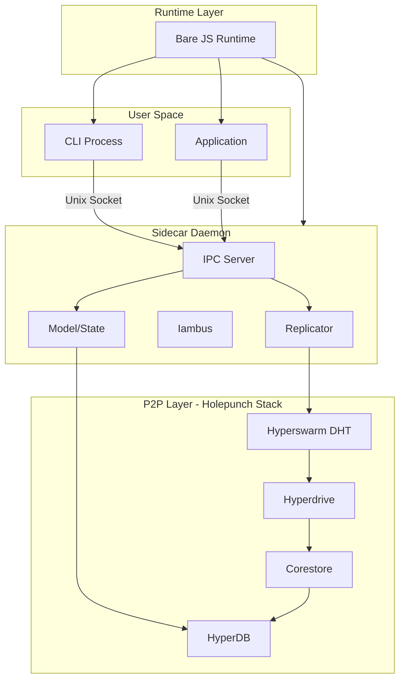
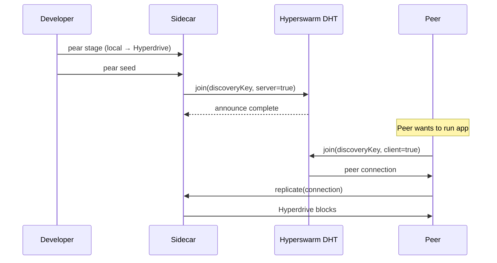
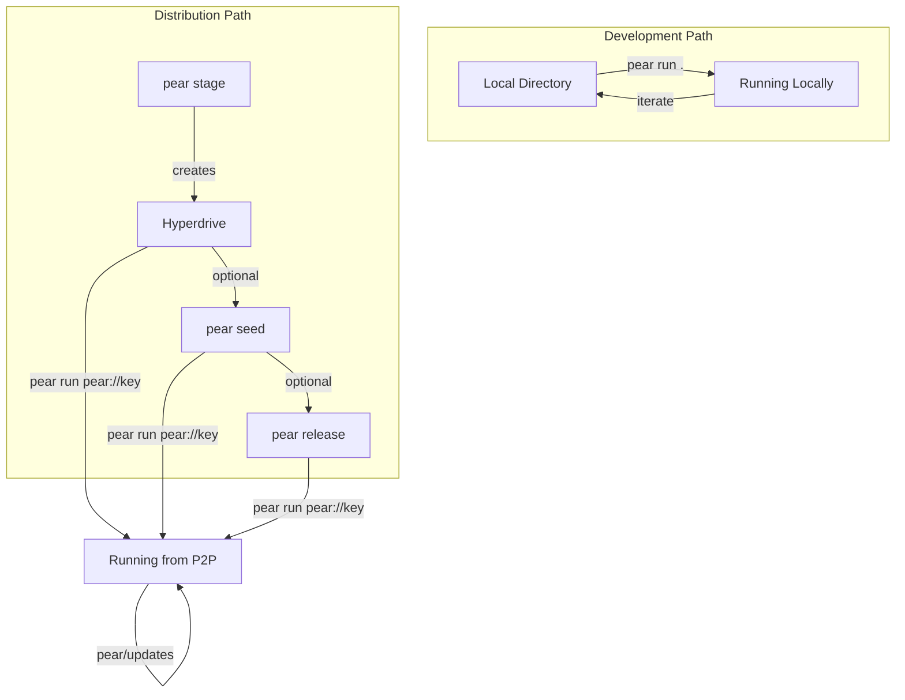

# Pear Runtime Architecture

## Target Audiences

This document serves three audiences:

| Audience | Focus Areas | Sections |
|----------|-------------|----------|
| **Framework Contributors** | Internal architecture, process model, IPC patterns | All sections |
| **Application Developers** | App lifecycle, API surface, debugging, limitations | 2, 4, 7, 12, 14, 15 |
| **Technical Evaluators** | Security model, performance, maturity signals | 2, 10, 13, 14, 16 |

## System Overview

Pear is a P2P desktop application framework built on the [Holepunch](https://holepunch.to) stack, running on the [Bare](https://github.com/holepunchto/bare) JavaScript runtime.

**Core properties:**
- Applications distributed via content-addressed Hyperdrives (no central server)
- Self-updating platform and applications with atomic rollback
- Cross-platform: macOS, Linux, Windows
- Offline-capable after initial sync

**Architecture in one sentence:** A long-lived sidecar daemon manages P2P networking, storage, and app lifecycle; CLI and applications communicate with it via Unix socket IPC.

## Core Architecture



## Process Architecture

*Audience: Contributors*

### Boot Flow

```
boot.js
  ├── --sidecar flag → sidecar.js → Sidecar daemon
  └── default → cli.js → CLI client
```

**Sidecar** (`subsystems/sidecar/index.js`): Long-lived daemon process responsible for:
- P2P networking (Hyperswarm)
- Storage management (Corestore, HyperDB)
- App lifecycle (spawn, teardown, updates)
- IPC server for CLI/app communication

**CLI** (`cli.js`): Ephemeral process that:
- Connects to sidecar via IPC (auto-boots sidecar if not running via `pear-tryboot`)
- Dispatches commands to sidecar operations
- Streams operation results back to terminal

**Applications**: Spawned by sidecar, communicate back via IPC for:
- Configuration (`config()`)
- Reports and messages (`reports()`, `messages()`)
- Drive operations (`get()`, `list()`, `bundle()`)
- Lifecycle events (`unloading()`, teardown)

### Key Files

| File | Purpose |
|------|---------|
| `boot.js` | Entry point, routes to CLI or sidecar |
| `sidecar.js` | Sidecar bootstrap, corestore/drive setup |
| `cli.js` | CLI entry, IPC client setup |
| `subsystems/sidecar/index.js` | Main Sidecar class |
| `subsystems/sidecar/state.js` | Per-app state management |

## P2P Stack Integration

*Audience: Contributors, Evaluators*

Pear builds on the Holepunch stack for P2P capabilities:

| Component | Purpose | Usage in Pear |
|-----------|---------|---------------|
| [Hyperswarm](https://github.com/holepunchto/hyperswarm) | DHT-based peer discovery | App distribution, replication |
| [Hyperdrive](https://github.com/holepunchto/hyperdrive) | Content-addressed filesystem | App code and asset storage |
| [Corestore](https://github.com/holepunchto/corestore) | Hypercore storage manager | Platform and app data persistence |
| [HyperDB](https://github.com/holepunchto/hyperdb) | Schema-driven database | App traits, assets, presets, GC |

### Replication Flow



### Swarm Management

- Global swarm instance per sidecar (lazy init after 5s delay)
- Key pair generated via `corestore.createKeyPair('holepunch')`
- Known DHT nodes cached in database for faster reconnection
- All connections replicate entire corestore: `swarm.on('connection', (c) => corestore.replicate(c))`

## IPC Communication

*Audience: Contributors*

### Architecture

- **Server**: Sidecar runs `pear-ipc` server on Unix socket (`SOCKET_PATH`)
- **Client**: CLI and apps use `pear-ipc` client for RPC
- **Pattern**: Operations return Opstreams (streaming tagged events)

### Opstream Pattern

Operations stream `{ tag, data }` events during execution:

```javascript
for await (const { tag, data } of ipc.stage({ dir, key })) {
  if (tag === 'staging') console.log('Started staging')
  if (tag === 'file') console.log('Staged:', data.path)
  if (tag === 'final') console.log('Complete:', data)
}
```

Common tags: `staging`, `file`, `byte-diff`, `stats`, `complete`, `error`, `final`

### Key IPC Methods

| Method | Purpose |
|--------|---------|
| `run(params)` | Execute app from link or directory |
| `stage(params)` | Sync local files to Hyperdrive |
| `dump(params)` | Sync Hyperdrive to local directory |
| `seed(params)` | Join DHT for peer discovery |
| `release(params)` | Pin production version |
| `identify(params)` | Register client process with sidecar |
| `config(params)` | Get app configuration |
| `reports(params)` | Stream app reports |
| `messages(pattern)` | Pub/sub messaging |

## Application Lifecycle

*Audience: Developers, Contributors*

### Two Parallel Paths



### Commands

| Command | Required? | Purpose |
|---------|-----------|---------|
| `pear init [template]` | Optional | Scaffold project from template |
| `pear run .` | - | Run local directory directly (dev mode) |
| `pear stage` | For distribution | Sync local → Hyperdrive, tree-shaking, bundling |
| `pear seed` | For discoverability | Join DHT so peers can find your app |
| `pear release` | For production | Pin specific version as stable release |
| `pear run pear://key` | - | Run any staged/seeded/released app |

**Key insight**: Local development (`pear run .`) requires no staging/seeding/releasing. The distribution path is additive.

### App Types

Configure in `package.json`:

```json
{
  "pear": {
    "name": "myapp",
    "gui": {
      "main": "index.html",
      "width": 800,
      "height": 600
    }
  }
}
```

- **Terminal apps**: No `gui` config, runs in terminal
- **Desktop apps**: With `gui` config, uses `pear-electron` for UI

## Storage Architecture

*Audience: Contributors*

See [STORAGE.md](STORAGE.md) for complete directory structure and file layout.

### Platform Directories

| OS | Path |
|----|------|
| macOS | `~/Library/Application Support/pear` |
| Linux | `~/.config/pear` |
| Windows | `%APPDATA%\pear` |

### Database Schema (HyperDB)

Schema defined in `spec/schema/schema.json` and `spec/db/db.json`:

| Collection | Key | Purpose |
|------------|-----|---------|
| `@pear/traits` | `link` | App metadata (storage path, encryption key, tags) |
| `@pear/assets` | `link` | Downloaded asset references |
| `@pear/current` | `link` | Version checkpoints per app |
| `@pear/presets` | `link` | Default flags per command/link |
| `@pear/gc` | `path` | Garbage collection markers |
| `@pear/dht` | - | Cached DHT bootstrap nodes |
| `@pear/manifest` | - | Platform version info |

## Update Mechanism

*Audience: Contributors, Developers*

### Two-Tier Updates

1. **Platform updates**: Managed by `pear-updater`, requires restart
2. **App updates**: Managed by Pod updater, can hot-reload or restart

### Atomic Swap Pattern

```
by-dkey/[platform-dkey]/
  ├── 0/  ← swap slot 0
  ├── 1/  ← swap slot 1
  ├── 2/  ← swap slot 2
  └── 3/  ← swap slot 3

current → symlink to active swap
```

- Updates download to next swap slot: `(current + 1) & 3`
- Symlink atomically switched on restart
- Rollback: switch symlink back to previous slot

### Update Notifications

Apps receive updates via `pear/updates` messages:

```javascript
import updates from 'pear-updates'

updates((update) => {
  console.log('Update available:', update)
  // { app: true/false, version, diff, updating, updated }
})
```

## Security Model

*Audience: Evaluators, Contributors*

### Trust System

- Apps require explicit trust before first run
- Untrusted `pear://` links trigger `ERR_PERMISSION_REQUIRED`
- User must approve; trust stored in `@pear/traits` database
- Trusted keys include platform aliases (`runtime`, `dev`, `electron`)

### Permission Flow

```
pear run pear://unknown-key
  → Check @pear/traits for key
  → Not found → ERR_PERMISSION_REQUIRED
  → User prompt → Approve
  → Store trust → Run permitted
```

### Cryptographic Foundations

| Component | Algorithm | Library |
|-----------|-----------|---------|
| Key pairs | Ed25519 | sodium-native |
| Content addressing | BLAKE2b | hypercore-crypto |
| Drive encryption | XSalsa20-Poly1305 | sodium-native |
| Key derivation | scrypt | pw-to-ek |

### Encryption

Drives can be encrypted with a key derived from password:

```javascript
// Encryption key derived via scrypt
const encryptionKey = await deriveEncryptionKey(password, SALT)
```

Encrypted drives require the encryption key for read/write access.

<!-- TODO: Security audit status
Document if/when security audits have been performed on:
- Hyperswarm DHT protocol
- Hyperdrive encryption implementation
- IPC trust model and socket permissions
- Key derivation parameters
-->

## CLI Command Architecture

*Audience: Contributors*

### Structure

```
cmd/index.js          ← Command parsing (paparam)
  ├── cmd/run.js      ← Run command definition
  ├── cmd/stage.js    ← Stage command definition
  └── ...

subsystems/sidecar/ops/
  ├── run.js          ← Run operation (Opstream)
  ├── stage.js        ← Stage operation (Opstream)
  └── ...
```

**Flow**: CLI parses args → IPC call → Sidecar creates Opstream → Events streamed back

### Core Commands

| Command | Operation Class | Purpose |
|---------|-----------------|---------|
| `pear run` | `ops/run.js` | Execute application |
| `pear stage` | `ops/stage.js` | Local → Hyperdrive sync |
| `pear seed` | `ops/seed.js` | Start P2P distribution |
| `pear release` | `ops/release.js` | Pin production version |
| `pear dump` | `ops/dump.js` | Hyperdrive → Local sync |
| `pear info` | `ops/info.js` | View app metadata |
| `pear gc` | `ops/gc.js` | Garbage collection |
| `pear data` | `ops/data.js` | Query platform database |

## Extension Points

*Audience: Developers*

### Preprocessing Hooks

```json
{
  "pear": {
    "pre": "my-preprocessor"
  }
}
```

Preprocessors run before app execution, can modify configuration.

### GUI Configuration

```json
{
  "pear": {
    "gui": {
      "main": "index.html",
      "width": 800,
      "height": 600,
      "minWidth": 400,
      "minHeight": 300
    }
  }
}
```

### Presets

Store default flags per command/link:

```bash
pear presets set pear://myapp run --dev
# Future: pear run pear://myapp automatically includes --dev
```

### Stage Configuration

```json
{
  "pear": {
    "stage": {
      "ignore": ["node_modules", "*.test.js"],
      "entrypoints": ["index.js", "worker.js"]
    }
  }
}
```

## Performance Characteristics

*Audience: Evaluators, Developers*

### Architecture-Level Properties

| Property | Implementation |
|----------|----------------|
| **Lazy loading** | Hyperdrive downloads only requested blocks |
| **Streaming** | Operations use Opstream for incremental progress |
| **Caching** | Global Rache cache (65KB max) for Hypercore blocks |
| **Deferred init** | Swarm starts after 5s delay to avoid premature spindown |
| **GC cycles** | Every 10 minutes to reclaim unused resources |
| **Spindown** | Sidecar auto-exits when no clients connected (configurable timeout) |

### Resource Management

- **Sessions**: Corestore sessions isolate resources per operation
- **Module cache**: Shared across subsystem loads
- **Connection limits**: Hyperswarm peers limited (default: 16 per topic)

<!-- TODO: Benchmarks
Actual measurements needed:
- Cold start time (first run vs cached)
- App sync latency (LAN vs WAN peers)
- Bundle size overhead vs raw source
- Memory footprint (sidecar idle, per-app overhead)
- DHT peer discovery time (bootstrap → first peer)
- Hyperdrive download throughput
-->

## Reliability & Known Limitations

*Audience: Developers, Evaluators*

### Reliability Features

| Feature | Implementation |
|---------|----------------|
| **Atomic updates** | Swap slots with symlink switch |
| **Graceful shutdown** | Teardown callbacks, `gracedown` handler |
| **Death clock** | 20s timeout for unresponsive process cleanup |
| **Session cleanup** | Resources tied to IPC client sessions |
| **Crash reporting** | `pear-crasher` captures uncaught exceptions |

### Known Limitations

| Limitation | Details |
|------------|---------|
| **Native modules** | Must be packaged as prebuilds for target platforms |
| **Bare runtime** | Subset of Node.js APIs (see `bare-*` modules) |
| **Desktop only** | Mobile support via Bare is separate project |
| **Single sidecar** | One sidecar instance per platform directory |

<!-- TODO: Document edge cases
- Behavior when all peers are offline
- Large file handling limits (blob size, total drive size)
- Concurrent app instance limits
- Memory pressure handling
-->

## Debugging & Troubleshooting

*Audience: Developers*

### Built-in Tools

| Tool | Command | Purpose |
|------|---------|---------|
| DevTools | `pear sidecar inspect` | Chrome DevTools for sidecar process |
| Data query | `pear data apps` | List known applications |
| Data query | `pear data dht` | Show cached DHT nodes |
| Data query | `pear data gc` | Show GC markers |
| Versions | `pear versions` | Show platform and dependency versions |

### Crash Logs

| Log | Location |
|-----|----------|
| Sidecar crashes | `sidecar.crash.log` |
| CLI crashes | `cli.crash.log` |
| App crashes | `[app-name].crash.log` |

### Common Issues

| Symptom | Likely Cause | Resolution |
|---------|--------------|------------|
| IPC connection timeout | Sidecar not running | Check `pear sidecar` status, restart |
| Replication stalls | DHT connectivity | Check network, bootstrap nodes |
| Update not applying | Symlink not switched | Restart sidecar |
| App won't start | Trust not granted | Run interactively to approve |
| Stage fails | Corestore locked | Check for other pear processes |

### Logging

Platform uses label-filtered logging (`pear-logger`) controllable via CLI switches.

## Architectural Strengths

*Audience: All*

### Why Pear's Architecture Matters

1. **P2P-first**: No central server required for app distribution. Apps identified by cryptographic keys, discoverable via DHT.

2. **Self-updating**: Both platform and applications update atomically. Swap slots enable instant rollback on failure.

3. **Cross-platform**: Bare runtime provides consistent JavaScript environment across macOS, Linux, Windows.

4. **Content-addressed**: Apps identified by Hyperdrive public keys. Content is tamper-evident—any modification changes the key.

5. **Offline-capable**: After initial sync, apps work without network. Updates sync opportunistically when peers available.

6. **Resource-managed**: Session-based cleanup prevents leaks. GC cycles reclaim unused storage. Spindown saves resources when idle.

7. **Minimal footprint**: Single sidecar daemon serves all apps. Lazy loading means only needed code is downloaded.

---

*Document version: Based on pear v2.0.0*
