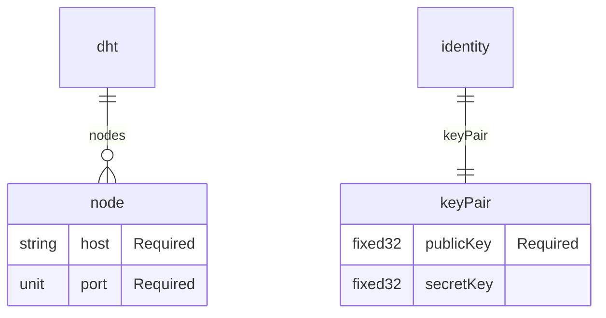

# Hyperdb Schema Diagram

A visual representation of [`schema.json`](../hyperdb/schema/schema.json) using [mermaid.js](https://github.com/mermaid-js/mermaid).

```mermaid
erDiagram
    node {
        string host "Required"
        unit port "Required"
    }
    dht {}
    dht ||--o{ node : nodes
    keyPair {
        fixed32 publicKey "Required"
        fixed32 secretKey
    }
    identity {}
    identity ||--|| keyPair : keyPair
```
